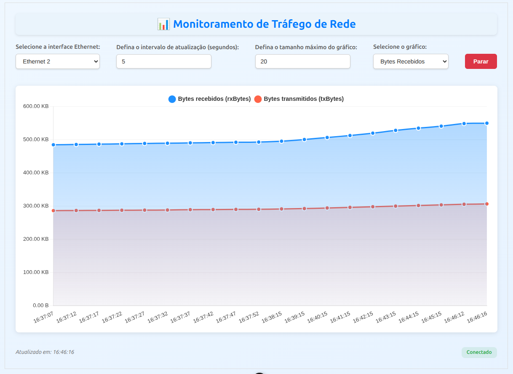

# Gráfico de Tráfego de Rede

Este projeto foi desenvolvido como parte da disciplina **Projeto e Administração de Redes**, ministrada pelo professor **Igor Luiz Oliveira de Souza**. O objetivo é criar uma interface web para monitorar em tempo real o gráfico de bandwidth da interface de rede de um roteador Mikrotik.

**Autores:** Heder Moreira David e Júlia Macêdo Galvão de Carvalho

## Descrição da Atividade

A atividade consiste em:

1. Criar uma interface web (linguagem e stack de livre escolha) que exiba em tempo real o gráfico de bandwidth da interface de rede de um roteador Mikrotik.
2. A entrega do trabalho é dividida em duas etapas:
   - Responder nesta atividade o link do repositório Github com o código.
   - Apresentar em sala de aula para o professor, comprovando o funcionamento ao gerar um teste de tráfego (**Bandwidth Test**) no roteador Mikrotik em monitoramento.

**Data de apresentação:** 12/06/2025.

## Tecnologias Utilizadas

- **Frontend:** Vue 3, Vite, Chart.js, Vue-Chartjs
- **Backend:** [SNMP Backend](https://github.com/hederdavid/snmp-backend) (disponível no repositório separado)
- **Outras Dependências:** Axios, D3.js, Date-fns

## Funcionalidades

- Monitoramento em tempo real do tráfego de rede.
- Exibição de gráficos de **Bytes Recebidos** e **Taxa de Transmissão**.
- Seleção de interface Ethernet e intervalo de atualização.
- Configuração do tamanho máximo do histórico do gráfico.
- Indicação de status de conexão com o roteador Mikrotik.

## Wireframe

Segue em anexo o wireframe ilustrando um esboço de sugestão de interface.



## Configuração do Projeto

### Pré-requisitos

- Node.js (versão 16 ou superior)
- NPM ou Yarn

### Instalação

1. Clone este repositório:

   ```sh
   git clone https://github.com/hederdavid/grafico-trafego.git
   cd grafico-trafego
   ```

2. Instale as dependências:

   ```sh
   npm install
   ```

3. Configure e inicie o backend disponível no repositório [SNMP Backend](https://github.com/hederdavid/snmp-backend).

4. Inicie o servidor de desenvolvimento:

   ```sh
   npm run dev
   ```

5. Acesse a aplicação no navegador em `http://localhost:5173`.

## Scripts Disponíveis

- `npm run dev`: Compila e inicia o servidor de desenvolvimento.
- `npm run build`: Compila o projeto para produção.
- `npm run preview`: Pré-visualiza a versão de produção.

## Estrutura do Projeto

```plaintext
grafico-trafego/
├── src/
│   ├── components/       # Componentes Vue
│   ├── App.vue           # Componente raiz
│   ├── main.js           # Arquivo principal
│   └── assets/           # Recursos estáticos
├── public/               # Arquivos públicos
├── package.json          # Configuração do projeto
├── vite.config.js        # Configuração do Vite
└── README.md             # Documentação do projeto
```

## Backend

O backend deste projeto está disponível no repositório [SNMP Backend](https://github.com/hederdavid/snmp-backend). Ele é responsável por coletar os dados SNMP do roteador Mikrotik e disponibilizá-los para o frontend.

## Apresentação

Durante a apresentação, será demonstrado o funcionamento da aplicação ao monitorar o tráfego de rede em tempo real, utilizando o **Bandwidth Test** do roteador Mikrotik.

## Licença

Este projeto é de uso acadêmico e não possui uma licença específica.
